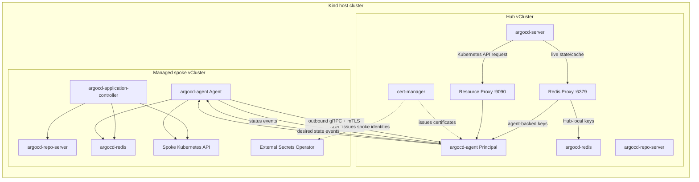

# Argo CD Agent Managed-Mode Hub/Spoke POC

A reproducible proof of concept for running **Argo CD Agent in managed mode** with one central control-plane cluster (the **Hub / Principal**) and one or more workload clusters (the **Spokes / Agents**).

The POC demonstrates that application desired state is owned centrally, reconciliation happens on the workload cluster, and health/sync status returns to the Hub without the Hub directly managing the spoke Kubernetes API.

> [!IMPORTANT]
> This repository is a **technical POC, not a production reference architecture**. It intentionally makes several local-development trade-offs that are called out in [Production hardening](#production-hardening).

## Status

**Validated end to end:**

- Agent authenticates to the Principal using mTLS.
- `AppProject` is distributed from Hub to managed spoke.
- `Application` is distributed from Hub to managed spoke.
- The spoke-side Argo CD application-controller reconciles the workload.
- Application status returns from spoke to Hub.
- The Hub reports the test application as `Synced` and `Healthy`.
- The guestbook workload runs on the spoke and not on the Hub.

The baseline is pinned to **argocd-agent `v0.9.0`**. The POC uses **namespace-based agent mapping**, which is the default and simplest mapping model for managed mode.

## Why this POC exists

Traditional multi-cluster Argo CD commonly requires the central Argo CD instance to hold credentials and establish connectivity to every workload cluster API. Argo CD Agent changes the model: an agent runs inside each workload cluster and establishes an outbound connection to the Principal.

This POC evaluates whether that model can provide:

- centralized application ownership and visibility;
- spoke-local reconciliation;
- reduced direct Hub-to-workload API connectivity;
- per-cluster identity through mTLS;
- live-resource access through the Agent resource proxy;
- automated certificate synchronization/rotation for the local lab.

## Architecture



### Component placement

| Component | Hub | Spoke | Reason |
|---|---:|---:|---|
| `argocd-server` | Yes | No | Central UI/API |
| `argocd-repo-server` | Yes | Yes | Hub API operations and spoke-local reconciliation |
| `argocd-redis` | Yes | Yes | Separate control-plane and execution-plane caches |
| `argocd-application-controller` | **No** | **Yes** | Workloads are reconciled on the workload cluster |
| Argo CD Agent Principal | Yes | No | Central agent endpoint and synchronization authority |
| Argo CD Agent Agent | No | Yes | Connects outward and applies managed resources locally |
| cert-manager | Yes | No | POC PKI and certificate issuance |
| External Secrets Operator | No | Yes | POC certificate refresh from Hub to spoke |

See [docs/DEEP_DIVE.md](docs/DEEP_DIVE.md) for the detailed protocol, certificate, Redis, proxy, and bootstrap explanation.

## Managed-mode data flow

With namespace-based mapping, the target agent is selected by the **Hub Application namespace**.

```text
Hub: staging-cluster/staging-guestbook
                    |
                    | Principal routes namespace "staging-cluster"
                    v
Agent identity: staging-cluster
                    |
                    v
Spoke: argocd/staging-guestbook
                    |
                    | application-controller reconciles
                    v
Spoke: guestbook/* workload resources
```

Status travels in the reverse direction:

```text
Spoke application status
        -> Agent
        -> Principal
        -> Hub Application status
        -> argocd-server / UI
```

## Repository layout

```text
.
├── README.md
├── bootstrap.sh
├── diagnose.sh
├── Makefile
├── test-app.yaml
├── docs/
│   └── DEEP_DIVE.md
├── manifests/
│   ├── hub/
│   │   ├── 01-ca-setup.yaml
│   │   ├── 02-mtls-certs.yaml
│   │   ├── 03-principal-config.yaml
│   │   ├── 04-managed-app-project.yaml
│   │   ├── argo-cluster-template.yaml
│   │   ├── eso-rbac-template.yaml
│   │   ├── resource-proxy-client-cert-template.yaml
│   │   └── spoke-cert-template.yaml
│   └── spoke/
│       └── eso-sync-template.yaml
├── go.mod
├── tests/
│   ├── repository_test.go
│   └── e2e/
│       └── smoke_test.go
└── .github/
    └── workflows/
        └── validate.yml
```

## Prerequisites

The bootstrap assumes the following CLIs are installed and available on `PATH`:

- Docker-compatible container runtime
- `kind`
- `kubectl`
- `helm`
- `vcluster`
- `envsubst` (GNU `gettext`)
- `openssl` for manual TLS debugging
- Go `1.23+` for repository tests

The Go test tooling intentionally uses only the Go standard library, so there are no Python or test-library dependencies to install.

The local machine must be able to pull images from the configured registries and fetch GitHub-hosted Kustomize manifests.

### Pinned/default dependencies

| Dependency | Default |
|---|---|
| Argo CD Agent | `v0.9.0` |
| cert-manager | `v1.14.4` |
| External Secrets Operator chart | `2.8.0` |
| Redis image override | `docker.io/library/redis:8.2-alpine` |

All can be overridden where exposed by environment variables in `bootstrap.sh`.

> [!NOTE]
> The upstream Argo CD Agent Kustomize overlays referenced by this POC currently consume Argo CD's `stable` manifest. That means pinning `AGENT_VERSION` alone does **not** make the complete dependency graph immutable. Vendor or explicitly pin the Argo CD manifest before using this pattern in production.

## Quick start

### 1. Initialize the Hub

```bash
chmod +x bootstrap.sh diagnose.sh
./bootstrap.sh init
```

This creates the Kind host, creates the Hub vCluster, installs the Hub-side Argo CD topology, creates the CA and Principal certificates, installs the Principal, configures the Redis proxy, and creates the managed `AppProject`.

### 2. Add a managed spoke

```bash
./bootstrap.sh add-spoke staging-cluster
```

The spoke name must be RFC-1123 compatible because it is used as an agent identity and, in this baseline, as the Hub routing namespace.

### 3. Run the end-to-end smoke test

```bash
./bootstrap.sh smoke-test staging-cluster
```

The smoke test now verifies all of the following:

1. `managed-agents` exists on the spoke.
2. The test `Application` is created on the Hub.
3. The `Application` appears on the spoke.
4. The spoke reports `Synced` and `Healthy`.
5. The Hub receives the returned status.
6. The guestbook workload exists on the spoke.

### 4. Add another spoke

```bash
./bootstrap.sh add-spoke production-cluster
./bootstrap.sh smoke-test production-cluster
```

The test manifest is templated automatically for non-staging spoke names.

## Testing

This repository uses **Go for all repository test code**. There is no Python test suite. Because the implementation is primarily Bash orchestration plus Kubernetes manifests, the highest-value unit-level tests are architecture and configuration **contract tests**, rather than function-level business-logic tests.

### Fast Go contract tests

`tests/repository_test.go` protects the invariants that previously caused failures, including:

- shell scripts pass `bash -n`;
- YAML templates render without unresolved environment placeholders and retain the expected Kubernetes document shape;
- the Agent connects to the Principal **Service port `443`**, not container port `8443`;
- managed mode is enabled;
- Hub Argo CD uses the Principal Redis proxy;
- Hub topology does not install an application-controller;
- spoke topology uses the managed-agent execution-plane overlay;
- Agent and resource-proxy client certificates remain separate identities;
- AppProject routing fields are compatible with namespace-based mapping;
- ESO references the correct certificate Secrets;
- no stale local `./external-secrets` chart path exists;
- the smoke-test contract requires `Synced` and `Healthy` and confirms the workload is absent from the Hub.

Run the same checks used in CI:

```bash
make check
```

Or run the Go suite directly:

```bash
go test ./... -count=1 -v
go vet ./...
```

The tests use only the Go standard library, so `go test` does not need to download third-party test packages.

### Go end-to-end wrapper

`tests/e2e/smoke_test.go` wraps the existing cluster-aware smoke test in Go. It is deliberately opt-in because it requires an already-running Kind/vCluster POC and changes live Kubernetes resources.

With an existing spoke:

```bash
RUN_E2E=1 E2E_SPOKE=staging-cluster go test ./tests/e2e -count=1 -v
```

Or through Make:

```bash
make e2e E2E_SPOKE=staging-cluster
```

### Full environment validation

The strongest architecture test remains a clean environment build followed by the Go-wrapped smoke test:

```bash
./bootstrap.sh init
./bootstrap.sh add-spoke staging-cluster
make e2e E2E_SPOKE=staging-cluster
```

For CI on a runner capable of nested Kind/vCluster workloads, this flow can be promoted into a separate e2e or nightly job. It is intentionally not part of the default pull-request workflow because it creates clusters and pulls multiple Kubernetes components.

## Configuration

The main environment overrides are:

```bash
HOST_CTX=kind-kubara-poc
HUB_CTX=vcluster-hub
AGENT_VERSION=v0.9.0
CERT_MANAGER_VERSION=v1.14.4
ESO_CHART_VERSION=2.8.0
REDIS_IMAGE=docker.io/library/redis:8.2-alpine
```

Example:

```bash
REDIS_IMAGE=registry.example.com/mirror/redis:8.2-alpine ./bootstrap.sh init
```

## TLS and certificate model

Each spoke has **two different client certificates** even though both are signed by the same CA:

| Certificate | Used by | Connects to | Identity purpose |
|---|---|---|---|
| `${spoke}-agent-client-tls` | Spoke Agent | Principal gRPC | Authenticates the Agent as `CN=<spoke>` |
| `${spoke}-resource-proxy-client-tls` | Hub Argo CD | Principal resource proxy | Selects/routes live-resource requests to `CN=<spoke>` |

The private keys are intentionally different. Do not reuse the Principal's server certificate as a client certificate.

The Principal itself uses `argocd-agent-principal-tls` as a **server certificate**, with a SAN for the vCluster-visible Principal DNS name. The Agent validates that server certificate against `argocd-agent-ca` and presents `argocd-agent-client-tls` during the same TLS handshake.

Detailed handshake and rotation diagrams are in [docs/DEEP_DIVE.md](docs/DEEP_DIVE.md#tls-pki-and-mtls-in-detail).

## Redis model

There are three Redis-related concepts in this topology:

1. **Hub `argocd-redis`** — Hub-local Argo CD data.
2. **Spoke `argocd-redis`** — cache used by the spoke application-controller and Agent.
3. **Principal Redis proxy** — the endpoint configured in Hub `argocd-server`; it forwards agent-backed cache access over the existing Agent connection and falls back to Hub Redis for Hub-local data.

The Hub must therefore use:

```yaml
data:
  redis.server: argocd-agent-redis-proxy:6379
```

A spoke Redis outage can leave the Agent connected over gRPC while still breaking application/cache operations, which is why `bootstrap.sh` explicitly waits for Redis readiness.

## Resource proxy and live resources

Argo CD's cluster Secret for each agent does **not** point directly to the spoke Kubernetes API. It points to the Principal resource proxy:

```text
https://argocd-agent-resource-proxy.argocd.svc.cluster.local:9090?agentName=<spoke>
```

The Hub presents the spoke-specific resource-proxy client certificate. The Principal identifies the target agent and carries the Kubernetes API request over the connected Agent channel.

This enables the central Argo CD server/UI to inspect live workload resources without direct Hub-to-spoke API connectivity.

## Local vCluster networking

The nested local environment needs a small workaround because DNS for services in one vCluster is not automatically resolvable from another vCluster.

The POC adds `hostAliases` entries for:

- the Principal DNS name in the Agent Pod;
- the Hub API DNS name in the ESO Pod.

The aliases point at **host-synchronized Kubernetes Service IPs**, not Pod IPs. Service IPs survive Pod restarts.

The Principal's Kubernetes Service exposes:

```text
Service port 443 -> Principal container port 8443
```

Agents must therefore connect to **port 443**. Using `8443` against the Service was one of the failures discovered while building this POC.

Do not copy this `hostAliases` approach into production. Use routable private DNS, load balancers, ingress/gateway, or a service mesh appropriate for your platform.

## Diagnostics

Run:

```bash
./diagnose.sh staging-cluster
```

Useful targeted checks:

```bash
# Agent connection
kubectl --context=vcluster-staging-cluster -n argocd \
  logs deployment/argocd-agent-agent --tail=100

# Principal authentication / event stream
kubectl --context=vcluster-hub -n argocd \
  logs deployment/argocd-agent-principal --tail=100

# Project and Application on spoke
kubectl --context=vcluster-staging-cluster -n argocd \
  get appproject,application

# Workload on spoke
kubectl --context=vcluster-staging-cluster -n guestbook \
  get deployment,pod,svc -o wide
```

See [docs/DEEP_DIVE.md](docs/DEEP_DIVE.md#troubleshooting-by-layer) for a layered troubleshooting model.

## Production hardening

Before treating this as a production design, address at least the following:

- **PKI:** replace the self-signed POC CA with organization-managed PKI or a supported automated identity mechanism.
- **JWT key:** replace `principal.jwt.allow-generate: "true"` with a persistent signing key.
- **Certificate delivery:** replace the long-lived service-account-token used by the POC ESO bridge with short-lived/bound identity or the organization's secret-management platform.
- **RBAC:** restrict Principal and Agent permissions to the minimum required resources.
- **Namespaces:** replace `principal.allowed-namespaces: "*"` and broad AppProject wildcards with explicit policy.
- **AppProject:** restrict source repositories, destinations, cluster resources, and namespace resources.
- **Network:** remove `hostAliases`; use supported cross-cluster networking and NetworkPolicies.
- **Versioning:** pin/vendor the Argo CD version instead of indirectly consuming `stable`.
- **Image supply chain:** use approved registries, digest pinning, image verification, SBOMs, and vulnerability scanning.
- **HA:** evaluate Principal HA, Redis availability, failure modes, reconnect behavior, and capacity limits.
- **Observability:** scrape Agent/Principal metrics, centralize logs, and alert on agent connection status, auth failures, queue saturation, and certificate expiry.
- **Secrets:** do not commit private keys, service-account tokens, kubeconfigs, or generated TLS material.
- **Mapping model:** evaluate destination-based mapping if multiple teams/namespaces need to share the same managed agent.

## Known POC limitations

- Recreates the local Kind host during `init`.
- Depends on internet access to GitHub and Helm/chart registries.
- Uses `hostAliases` for nested-vCluster networking.
- Uses broad RBAC/project policies for ease of demonstration.
- Uses a long-lived Kubernetes service-account token for ESO's cross-cluster read.
- Does not currently exercise Principal HA or disconnected operation for long periods.
- Does not load-test queue throughput or large application fleets.

## Open-source repository readiness

The technical repository now includes a README, automated validation workflow, and contribution-oriented tests. Before a company publishes the repository externally, the owning organization should also add or confirm its approved community-health and legal files, including:

- `LICENSE`
- `CONTRIBUTING.md`
- `CODE_OF_CONDUCT.md`
- `SECURITY.md` with the company's actual private vulnerability-reporting route
- ownership/maintainer information (`CODEOWNERS` where appropriate)
- issue and pull-request templates
- dependency and security update policy

Those files should follow the publishing company's legal, security, and open-source-program-office requirements; this POC does not invent company policy.

## References

- [Argo CD Agent — Getting started / component placement](https://argocd-agent.readthedocs.io/latest/getting-started/)
- [Argo CD Agent — Managed sync protocol](https://argocd-agent.readthedocs.io/latest/concepts/sync-protocol/)
- [Argo CD Agent — Agent mapping modes](https://argocd-agent.readthedocs.io/latest/concepts/agent-mapping/)
- [Argo CD Agent — AppProject synchronization](https://argocd-agent.readthedocs.io/latest/user-guide/appprojects/)
- [Argo CD Agent — mTLS authentication](https://argocd-agent.readthedocs.io/latest/configuration/authentication/)
- [Argo CD Agent — Live resources and Redis/resource proxies](https://argocd-agent.readthedocs.io/latest/user-guide/live-resources/)
- [External Secrets Operator — Kubernetes provider](https://external-secrets.io/latest/provider/kubernetes/)

## License

No license is included in this POC package. A company publishing this repository as open source must add the license approved by its legal/open-source governance process before public release.
