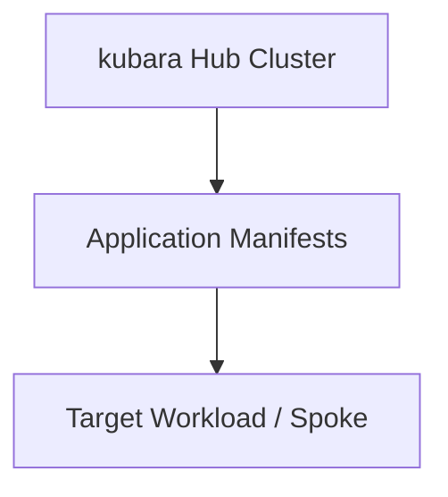

# Example title

Brief description of what this example demonstrates and why a platform engineer using kubara would want to explore it.

> [!WARNING]
> This example is a reference pattern, not a production-ready configuration. Review and adapt all configurations, credentials, and security controls before using them in real environments.

## Purpose

Explain the specific problem this example solves, the use case it addresses, and how it fits into or extends a kubara setup.

## Architecture

Describe the component layout, repository structure, or resource relationships.



## Type and prerequisites

- **Type**: `Architecture Pattern` or `Runnable Lab`
- **Related kubara concepts**: Catalogs, workload onboarding, Argo CD, AppProjects, Kustomize overlays, etc.

<!-- Choose the section below that fits your example type and remove the other. -->

<!-- OPTION A: For Architecture Pattern examples -->
### Prerequisites and context

List what the reader needs to know or have in place before applying this pattern:
- kubara version or layout assumptions (for example, standard `platform-components/` and `platform-configs/` setup)
- External prerequisites (for example, git repository structure, access permissions, upstream Helm charts)

<!-- OPTION B: For Runnable Lab examples -->
### Requirements

| Tool | Minimum version | Purpose |
|---|---|---|
| kubectl | v1.28+ | Manifest inspection |
| kind / vcluster | latest | Local test cluster |

## Structure

Outline the files and folders in this example:

```text
example-name/
├── README.md
├── manifests/
└── ...
```

Describe key artifacts and why they are organized this way.

<!-- Choose either "Pattern walkthrough" (Architecture Pattern) or "How to run" (Runnable Lab). -->

<!-- OPTION A: For Architecture Pattern examples -->
## Pattern walkthrough

Explain how the manifests and concepts work together.

### Key concepts and configuration points

Highlight specific fields, annotations, or files that make this pattern work.

### Adoption and integration

How a kubara platform engineer applies this pattern in their own `platform-configs/` or workload repositories. Note any trade-offs or alternatives.

## Where to go from here

- Links to relevant kubara documentation (for example: [Catalogs](https://docs.kubara.io/v0.16.0/2_concepts/catalogs/index.md), [Workload onboarding](https://docs.kubara.io/v0.16.0/5_workload_onboarding/overview/index.md))
- Upstream tool docs (for example, Argo CD, Kustomize, Kyverno)
- Related architecture examples in this repository

<!-- OPTION B: For Runnable Lab examples -->
<!--
## How to run

### Step 1: Bootstrap

Commands to start the local environment.

### Step 2: Verification

How to verify that the workload or controller functions as expected.

## Clean up

Commands to tear down clusters and local resources created during the lab.
-->
