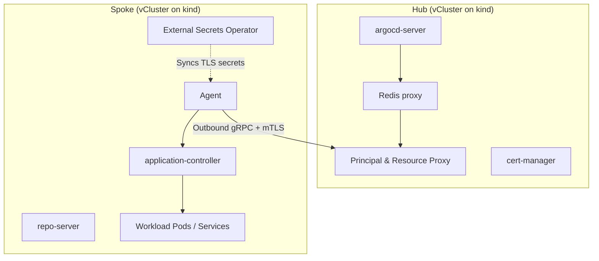

# Argo CD Agent managed-mode hub/spoke lab

A local kind and vCluster proof of concept demonstrating Argo CD Agent managed mode.

The Hub owns `Application` and `AppProject` definitions. Each spoke runs an Agent alongside a local application controller, reconciles workloads directly, and reports status back to the Hub. The Hub never connects directly to spoke Kubernetes API endpoints.

> [!WARNING]
> This example is a reference lab, not a production-ready configuration. It uses self-signed certificates, broad RBAC, and `hostAliases` to route traffic between nested vClusters. Review and adapt all configurations, credentials, and network policies before live deployment.

## Purpose

Platform teams running kubara often manage multi-cluster environments where central clusters should not have direct inbound network access or cluster-admin kubeconfigs to downstream spoke clusters.

This lab proves an alternative topology using Argo CD Agent:
- An Agent on the spoke authenticates outbound to the Hub Principal over mTLS.
- The Hub distributes `AppProject` and `Application` resources down to spokes.
- The spoke reconciles workloads locally and reports `Synced` and `Healthy` status back up to the Hub.
- Central Argo CD web UI and CLI view live spoke resources through the Principal resource proxy.

## Architecture



The Hub runs no application controller. The spoke runs its own controller. Reconciliation happens strictly inside the spoke.

## Type and prerequisites

- **Type**: `Runnable Lab`
- **Related kubara concepts**: Multi-cluster topologies, spoke clusters, workload onboarding, Argo CD catalogs.

### Requirements

| Tool | Minimum version | Purpose |
|---|---|---|
| Docker / container runtime | latest | kind node execution |
| kind | v0.20+ | Host cluster |
| vcluster | v0.19+ | Nested Hub and Spoke virtual clusters |
| kubectl | v1.28+ | Cluster interaction |
| helm | v3.12+ | Dependency installations |
| envsubst (gettext) | latest | Manifest template substitution |
| Go | 1.23+ | Contract and E2E verification test execution |

Pinned component defaults used during bootstrap:

| Dependency | Pinned version |
|---|---|
| Argo CD Agent | `v0.9.0` |
| cert-manager | `v1.14.4` |
| External Secrets Operator | `2.8.0` |
| Redis | `8.2-alpine` |

## Structure

```text
argo-cd-agents/
├── README.md
├── Makefile               # Test and verification targets
├── bootstrap.sh           # Lifecycle script (init, add-spoke, smoke-test)
├── diagnose.sh            # Health check and debugging helper
├── test-app.yaml          # Sample guestbook workload manifest
├── manifests/
│   ├── hub/               # CA, mTLS, Principal config, and AppProject templates
│   └── spoke/             # ESO sync templates for spoke-side certificates
└── tests/                 # Repository contract and E2E tests
```

## How to use

### Step 1: Initialize the Hub

Make scripts executable and initialize the kind host cluster and Hub vCluster:

```bash
chmod +x bootstrap.sh diagnose.sh
./bootstrap.sh init
```

### Step 2: Onboard a spoke cluster

Add a spoke named `staging-cluster` (must follow RFC 1123 DNS naming):

```bash
./bootstrap.sh add-spoke staging-cluster
```

You can onboard additional spokes as needed:

```bash
./bootstrap.sh add-spoke production-cluster
```

### Step 3: Verification

Run the automated smoke test. This submits a test guestbook Application to the Hub, waits for it to propagate to the spoke, confirms reconciliation on the spoke, and verifies that the workload never runs on the Hub:

```bash
./bootstrap.sh smoke-test staging-cluster
```

Run static contract checks and syntax validations:

```bash
make check
```

Optionally run the full Go end-to-end test against the running environment:

```bash
make e2e E2E_SPOKE=staging-cluster
```

### Diagnostics

If synchronization stalls, inspect components using `diagnose.sh` or direct logs:

```bash
./diagnose.sh staging-cluster

# Check spoke Agent logs
kubectl --context=vcluster-staging-cluster -n argocd \
  logs deployment/argocd-agent-agent --tail=100

# Check Hub Principal authentication and events
kubectl --context=vcluster-hub -n argocd \
  logs deployment/argocd-agent-principal --tail=100

# Inspect spoke workload state
kubectl --context=vcluster-staging-cluster -n guestbook \
  get deployment,pod,svc -o wide
```

## Clean up

To remove the kind cluster and all nested vCluster instances:

```bash
kind delete cluster --name kubara-poc
```

If you configured a custom `HOST_CTX` or cluster name in environment variables, pass that name to `kind delete cluster --name <name>`.

## Where to go from here

- [Argo CD Agent: getting started](https://argocd-agent.readthedocs.io/latest/getting-started/)
- [Argo CD Agent: managed sync protocol](https://argocd-agent.readthedocs.io/latest/concepts/sync-protocol/)
- [Argo CD Agent: mapping modes](https://argocd-agent.readthedocs.io/latest/concepts/agent-mapping/)
- [Argo CD Agent: authentication](https://argocd-agent.readthedocs.io/latest/configuration/authentication/)
- [Argo CD Agent: live resources](https://argocd-agent.readthedocs.io/latest/user-guide/live-resources/)
- [kubara spoke cluster documentation](https://docs.kubara.io/v0.16.0/4_building_your_platform/add_spoke_cluster/index.md)
