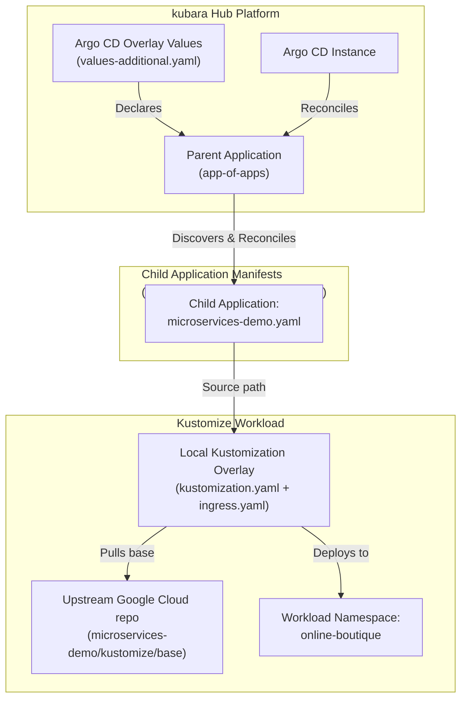

# Kustomize application onboarding with App of Apps

A reference pattern demonstrating how to onboard a Kustomize-managed application (Google Cloud microservices-demo) into a kubara cluster using the App of Apps pattern without creating a new kubara catalog.

> [!WARNING]
> This example is a reference architecture pattern, not a production-ready configuration. Review and adapt namespaces, ingress routes, domains, and security contexts before using them in live environments.

## Purpose

kubara catalogs package reusable platform-level infrastructure (like cert-manager, external-dns, or monitoring). User-facing workloads and third-party applications do not belong in catalogs. Instead, kubara documentation recommends onboarding applications through Argo CD.

This pattern demonstrates:
- How to declare an App of Apps root application in Argo CD overlay values (`values-additional.yaml`) under `platform-configs/`.
- How the root application scans `platform-configs/<cluster>/apps/` for child application manifests.
- How to onboard a Kustomize application ([Google Cloud Online Boutique](https://github.com/GoogleCloudPlatform/microservices-demo)) referencing remote upstream Kustomize components.
- How to patch and extend third-party manifests locally with custom labels, images, and ingress routes.

## Architecture



## Type and prerequisites

- **Type**: `Architecture Pattern`
- **Related kubara concepts**: Workload onboarding, App of Apps pattern, Argo CD overlay values (`values-additional.yaml`), general catalog.

### Prerequisites and context

Before adopting this pattern, familiarize yourself with:
- Standard kubara repository layout (`platform-components/` and `platform-configs/`).
- Argo CD `Application` CRD and source types (Helm, Kustomize, Directory).
- Kustomize remote resource syntax (`github.com/org/repo//path?ref=tag`).

## Structure

```text
kustomize-application-onboarding/
├── README.md
├── .env.example                    # Sample environment variables for kubara init/bootstrap
├── config.yaml                     # kubara cluster configuration using default general catalog
└── platform-configs/
    └── hub-cluster/
        ├── helm/
        │   └── argo-cd/
        │       └── values-additional.yaml    # Parent App of Apps definition
        └── apps/
            ├── microservices-demo.yaml       # Child Argo CD Application
            └── microservices-demo/
                ├── kustomization.yaml        # Kustomize overlay pulling upstream base
                └── ingress.yaml              # Local Traefik IngressRoute extension
```

## Pattern walkthrough

### Step 1: Declare the App of Apps parent application

Rather than modifying generated files, add the parent application to `platform-configs/<cluster>/helm/argo-cd/values-additional.yaml`:

```yaml
bootstrapValues:
  applications:
    - name: app-of-apps
      namespace: argocd
      projectName: hub-cluster-dev
      destination:
        server: https://kubernetes.default.svc
      repoUrl: https://github.com/my-org/platform-repo.git
      targetRevision: main
      repoPath: platform-configs/hub-cluster/apps
      directory:
        recurse: true
      info:
        - name: type
          value: app-of-apps
```

Argo CD automatically reconciles this parent application when Git changes are pushed.

### Step 2: Add child application manifests

Place child Argo CD `Application` manifests in `platform-configs/<cluster>/apps/`. Here, `microservices-demo.yaml` points to the local Kustomize overlay directory:

```yaml
apiVersion: argoproj.io/v1alpha1
kind: Application
metadata:
  name: microservices-demo
  namespace: argocd
  finalizers:
    - resources-finalizer.argocd.argoproj.io
spec:
  project: hub-cluster-dev
  source:
    repoURL: https://github.com/my-org/platform-repo.git
    targetRevision: main
    path: platform-configs/hub-cluster/apps/microservices-demo
  destination:
    server: https://kubernetes.default.svc
    namespace: online-boutique
  syncPolicy:
    automated:
      prune: true
      selfHeal: true
    syncOptions:
      - CreateNamespace=true
```

### Step 3: Configure the Kustomize overlay

In `platform-configs/<cluster>/apps/microservices-demo/kustomization.yaml`, reference the upstream Google Cloud microservices-demo base repository and layer local customizations:

```yaml
apiVersion: kustomize.config.k8s.io/v1beta1
kind: Kustomization

namespace: online-boutique

resources:
  - github.com/GoogleCloudPlatform/microservices-demo/kustomize/base?ref=v0.10.1
  - ingress.yaml

labels:
  - pairs:
      app.kubernetes.io/managed-by: kubara-argocd
      environment: dev

images:
  - name: frontend
    newName: gcr.io/google-samples/microservices-demo/frontend
    newTag: v0.10.1
```

Argo CD runs `kustomize build` during sync, pulls the upstream base directly from GitHub, applies local patches and ingress routes, and deploys everything into the target cluster namespace.

## Where to go from here

- [kubara: Argo CD Add App of Apps](https://docs.kubara.io/next/4_building_your_platform/argocd-add-app-of-apps/index.md)
- [kubara: How to add an Application to Argo CD](https://docs.kubara.io/next/5_workload_onboarding/add_application/index.md)
- [kubara: Catalogs concept](https://docs.kubara.io/next/2_concepts/catalogs/index.md)
- [Google Cloud microservices-demo repository](https://github.com/GoogleCloudPlatform/microservices-demo)
- [Kustomize official documentation](https://kubectl.docs.kubernetes.io/guides/introduction/kustomize/)
