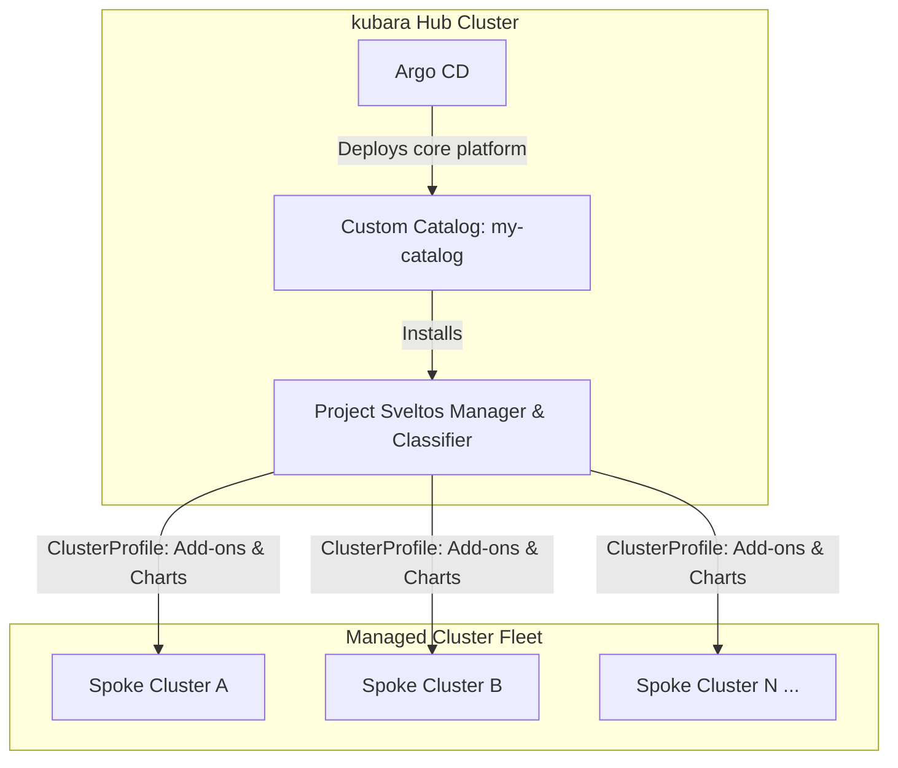

# Scalable cluster management with Project Sveltos

A reference GitOps repository pattern demonstrating how to use Project Sveltos alongside kubara to manage add-ons and configurations across multi-cluster fleets at scale, using Sveltos instead of central Argo CD for cluster-fleet configuration.

> [!WARNING]
> This example is a reference architecture pattern, not a production-ready configuration. It contains sample domains, placeholder repositories, and unhardened test credentials. Review and adapt all configurations, domain names, and access policies before using them in live environments.

## Purpose

While Argo CD excels at application lifecycle management on individual clusters, managing hundreds of clusters directly with central Argo CD can create scalability bottlenecks, high memory consumption, and tight coupling between the hub and spoke APIs.

This reference pattern shows how kubara users offload multi-cluster fleet management to Project Sveltos:
- Central Argo CD manages the hub platform controllers and custom catalogs.
- Project Sveltos handles multi-cluster distribution, add-on management, and drift detection across downstream clusters (shown here with virtual clusters as test spokes).
- A custom kubara catalog (`my-catalog`) packages `projectsveltos`, `kro`, `vcluster-platform`, and `vcluster` as modular platform services.
- Sveltos `ClusterProfile` resources declaratively target clusters using labels and classifiers, rolling out Helm charts and Kubernetes manifests across the fleet without central Argo CD needing active connections to every spoke workload.

## Architecture



## Type and prerequisites

- **Type**: `Architecture Pattern`
- **Related kubara concepts**: Catalogs, custom `ServiceDefinition`, multi-cluster management, spoke cluster onboarding.

### Prerequisites and context

Before adopting or inspecting this pattern, review:
- kubara configuration structure (`config.yaml`, `platform-components/`, `platform-configs/`).
- kubara custom catalog definitions (`Catalog.yaml` and `services/*.yaml`).
- Project Sveltos concepts: `ClusterProfile`, `Classifier`, and Sveltos agent architecture.

## Structure

```text
sveltos-cluster-management/
├── README.md
├── config.yaml                     # kubara cluster configuration (hub and spoke definitions)
├── my-catalog/                     # Custom kubara catalog
│   ├── Catalog.yaml                # Catalog metadata (v0.1.0)
│   ├── services/                   # ServiceDefinitions: projectsveltos, kro, vcluster, etc.
│   ├── platform-components/        # Sveltos and auxiliary Helm charts
│   │   └── helm/projectsveltos/    # Project Sveltos platform chart with ClusterProfiles
│   └── platform-configs/           # Generated value templates
├── apps/                           # Argo CD Application manifests for spinning up spokes
├── platform-components/            # Shared platform Helm components
│   └── helm/                       # OAuth2 Proxy, vCluster platform charts
└── platform-configs/               # Cluster-specific generated overlays
    ├── hub-cluster/                # Hub cluster configuration (Sveltos manager, Traefik, monitoring)
    ├── vcluster-1/                 # Spoke cluster 1 configuration
    └── vcluster-2/                 # Spoke cluster 2 configuration
```

## Pattern walkthrough

### Offloading fleet distribution to Sveltos

In standard kubara topologies, spoke clusters can be registered directly into Argo CD. As cluster counts grow, central Argo CD controllers must maintain active watches and caches for every spoke cluster.

In this architecture:
1. **Argo CD stays focused on the Hub**: Argo CD only reconciles the hub platform itself and deploys the Sveltos control plane from the custom catalog.
2. **Sveltos manages the Fleet**: Sveltos takes over downstream cluster classification, add-on lifecycle, and configuration delivery.

### Custom catalog definition for Sveltos

The service is packaged as a first-class kubara catalog service in `my-catalog/services/projectsveltos.yaml`:

```yaml
apiVersion: kubara.io/v1alpha1
kind: ServiceDefinition
metadata:
  name: projectsveltos
  annotations:
    kubara.io/category: application-management
spec:
  chartPath: projectsveltos
  status: enabled
  clusterTypes:
    - hub
```

The underlying Helm chart (`my-catalog/platform-components/helm/projectsveltos/`) configures the Sveltos controllers, custom `ClusterProfile` manifests, and Prometheus `ServiceMonitor` definitions.

### Dynamic cluster targeting with ClusterProfiles

Instead of creating separate Argo CD Application manifests for each target cluster, Sveltos uses declarative matching:

```yaml
apiVersion: config.projectsveltos.io/v1beta1
kind: ClusterProfile
metadata:
  name: platform-baseline
spec:
  clusterSelector:
    matchLabels:
      env: production
  helmCharts:
    - chartName: prometheus
      repositoryURL: https://prometheus-community.github.io/helm-charts
...
```

When new clusters join or match the selector, Sveltos automatically deploys and synchronizes the defined add-ons and manifests without modifying the central GitOps control plane.

## Where to go from here

- [Project Sveltos official documentation](https://projectsveltos.github.io/sveltos/)
- [Project Sveltos: ClusterProfile concept](https://projectsveltos.github.io/sveltos/features/cluster-profiles/)
- [kubara: Catalogs concept](https://docs.kubara.io/v0.16.0/2_concepts/catalogs/index.md)
- [kubara: How to create a Catalog](https://docs.kubara.io/v0.16.0/4_building_your_platform/create_catalog/index.md)
- [kubara: Spoke cluster onboarding](https://docs.kubara.io/v0.16.0/4_building_your_platform/add_spoke_cluster/index.md)
